## Project 3: Forage

## **Contents**

*	[Overview](#overview)
*	[The Brief & Timeframe](#the-brief--timeframe) 
*	[Technologies used](#technologies-used) 
*	[App Flow](#app-flow) 
*	[The Planning & Development Process](#the-planning--development-process) 
*	[Wins & Challenges](#wins--challenges)
*	[Known Bugs](#known-bugs)
*	[Future Enhancements](#future-enhancements) 
*	[Key Learnings](#key-learnings)

### **Overview**
---

Forage is a Pinterest-style app where users can upload images and create theme-based boards, where they can add their images or others for inspiration. 

Project three was built with GA classmates [Henry Phillpotts](https://github.com/hphilpotts) and [Ivan Craig](https://github.com/ic188002). 

You will find the source code on GitHub [here](https://github.com/HelenevB/SEI-project03-Forage).

**Code Installation and Access**

* To access it locally, you can clone the code
* Configure to your local PostgreSQL database (lines 87 – 89 of the settings.py file) 
* Run the command "pip install -r requirements.txt" to install the required dependencies 
* Run the command "python3 manage.py runserver" to start the application

**Deployment**

You will find the deployed application via Heroku [here](https://namesei66.herokuapp.com/).

To explore the full features Forage has to offer,  feel free to log in using the following credentials: 

**Username**: demouser1 
**Password**: testpassword 

Please note that there is an issue with image upload where Heroku’s file storage deletes any newly uploaded images after less than 24 hours. Therefore, many image links are broken where uploaded files have been removed. Any freshly uploaded images will not render correctly after 24 hours. 

### **The Brief & Timeframe**
---

* Build an application using Python and Django Framework 
* Utilising PostgreSQL for database storage
* Create the application using two related models, one of which should be the user
* Include all significant CRUD functions for at least one model 
* Add authentication and authorisation to restrict access to appropriate users
* Give feedback to the user after each action and after form submission
* Deploy the application online so that it is publicly accessible
* Timeframe:  7 Days 

### **Technologies Used**
---

* Python
* Django Framework
* CSS
* JavaScript/JQuery
* PostgreSQL
* Heroku (for Deployment)
* Development Tools – Trello, Zoom, Slack, Git, GitHub

### **App Flow**
---

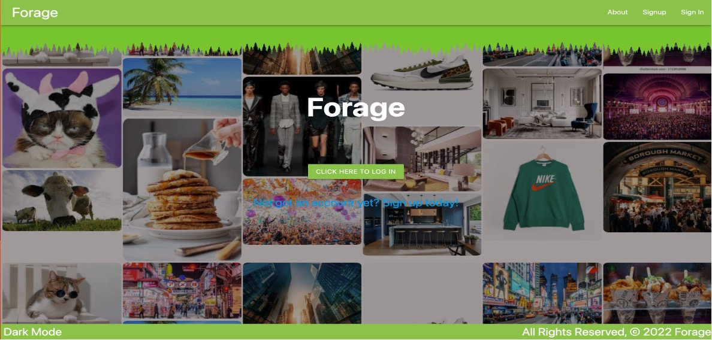

Upon sign-up, users get directed to their profile. They then have the option of adding a profile picture and bio: 

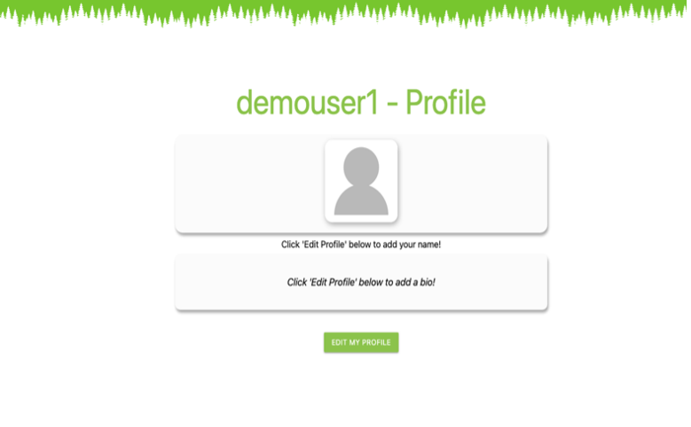 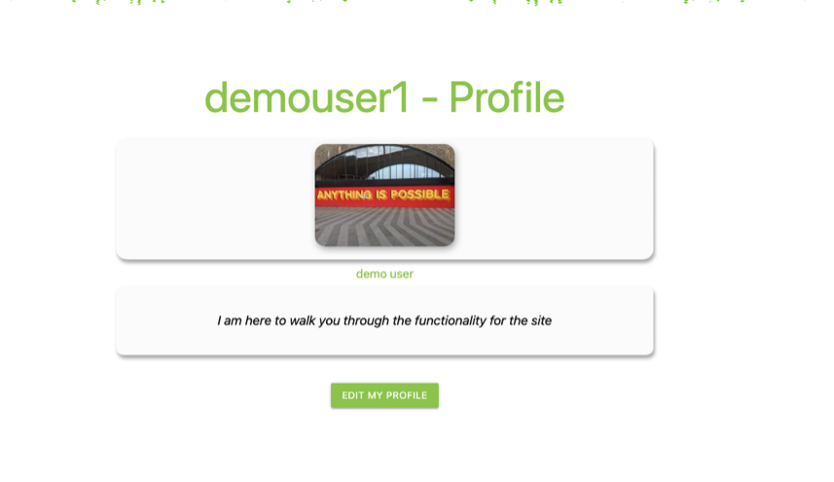

Once logged in user can create boards: 

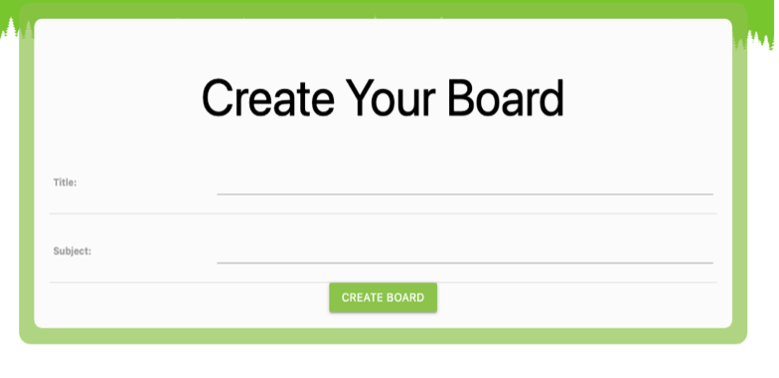 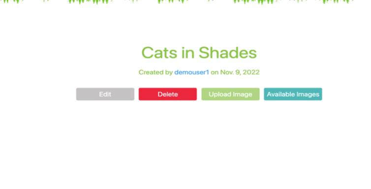

Once the boards are created, users have the option of uploading an image directly to the board or adding an image that is already on the site:  

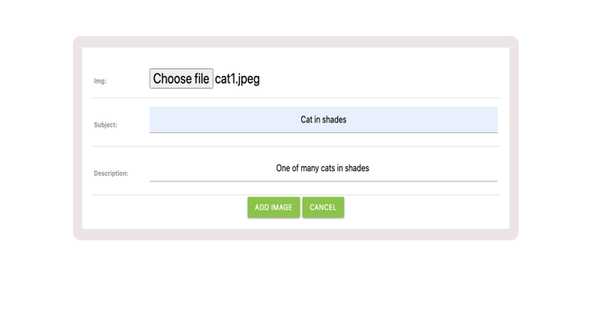 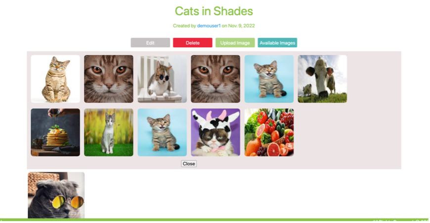

Once an image is added, users can remove an image from the board or delete the board entirely: 

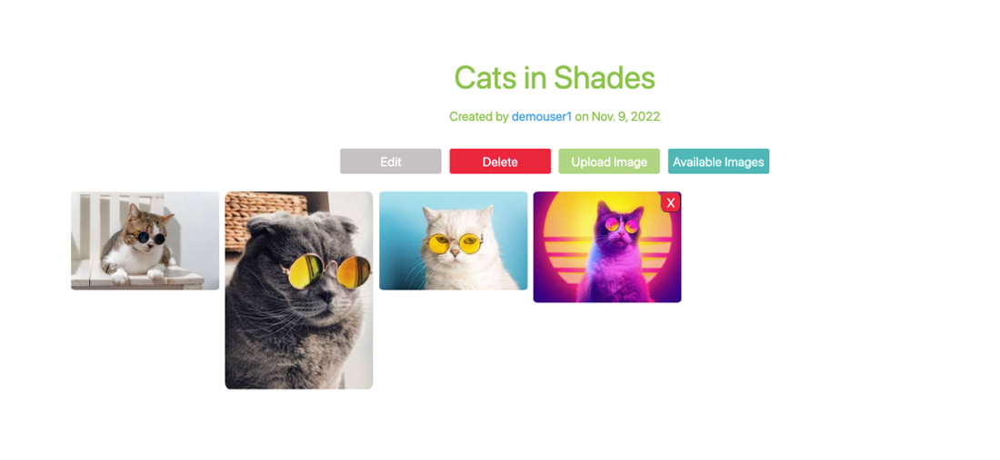

Any boards the users created will be displayed on their profile: 

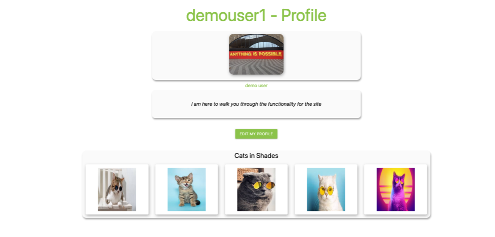

**Functionality**:

*	Sign-up, log-in and log-out 
*	View, update,edit and delete your profile 
*	Create, update, edit, and delete your board 
*	Add a new image or image available on the site to your board 
*	Remove images from your board 
*	Add Images to the site, edit and delete these images 
*	View all images available on the site 

### **The Planning & Development Process**
---
We landed on making a Pinterest-style application relatively quickly, as we were keen to create a website with much visual content. 

Upon deciding on the idea, we kickstarted the planning process. As the team lead, I set up the main project folder and associated GitHub repository. 

To help establish the relationship between our models, we mapped out our ERD:

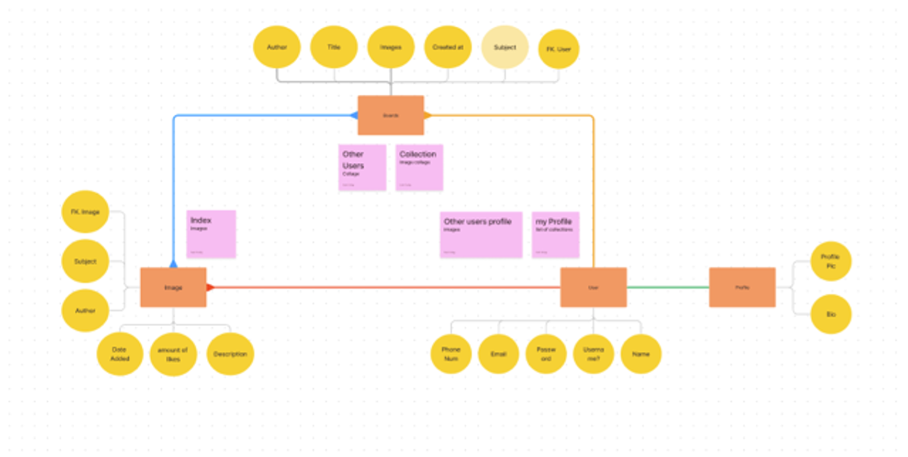

We identified: 

1. The user would have a one-to-many relationship with boards and images 
2. Images would have a many-to-many relationship with boards
3. The user would have a one-to-one relationship with the profile 

We discussed the flow of the site, and Ivan drew up the wireframes using the app Procreate:

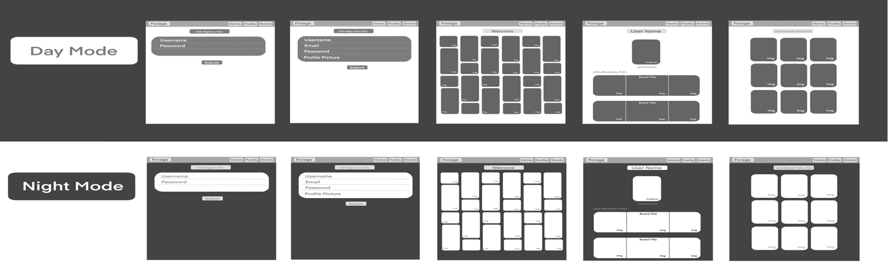

Once we had the structure for the site in place, the last task was to divide the workload. As we only had a week to complete the project, we wanted to ensure we split this as evenly as possible, so we decided to take a model each and work on the relevant CRUD functionality. 

We then used Trello to document our progress:

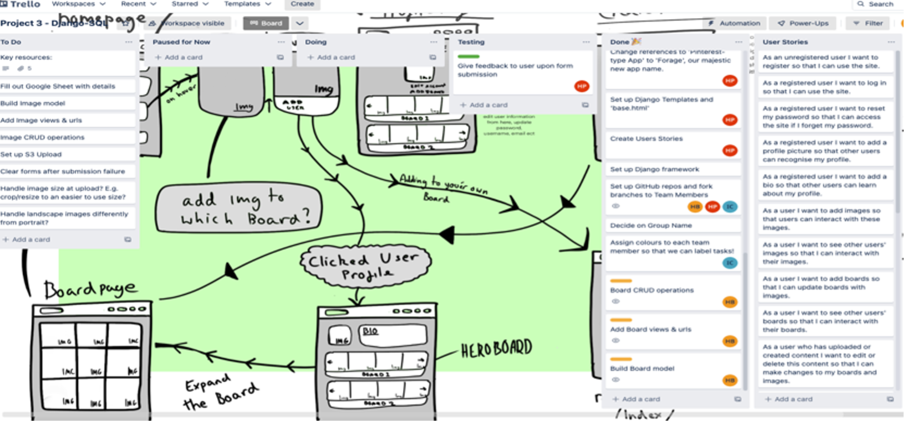

I was excited to work on “boards” as it was a chance to challenge myself both from a functionality and CSS perspective. 

I started the build process by creating the board model; I then used Django’s class-based views to create, update, and delete an instance of the board model. Using CBV allowed me to avoid repetition, making the build relatively quick. I was then able to  focus on the main task, which was making sure the board functionality worked smoothly:

**Adding another user’s image and removing images from the board** 

Since we had covered association and de-association in our class code-along sessions, I could tackle adding and removing images already on Forage to a board comfortably. 

The critical aspect of this was ensuring only un-associated images (those not already displayed on the board) were listed for the user to select. I needed to query this from the board detail’s view function and add them to the context being passed to the template.

By using the exclude method, I returned a query set that did not match the lookup parameters. If the “image _id“ were found in "board.images”, those images would not be displayed as an option to add. 

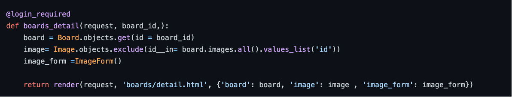

**Adding a new image to a board** 

Since our Image Model had already been created, rendering an ‘add image’ form to the board details did not take too long, as I could utilise code that my teammate had already written. Once I had the form template created, I needed to ensure that the image displayed instantly upon submission; this is where I encountered some challenges. 

Firstly, the image itself was not posting; I was having difficulty establishing why so after consulting with the team, I found that I had omitted the ‘request. Files’, which Django needs to handle image upload. Once this was corrected, I checked the database and saw that the image was 
stored.  
  
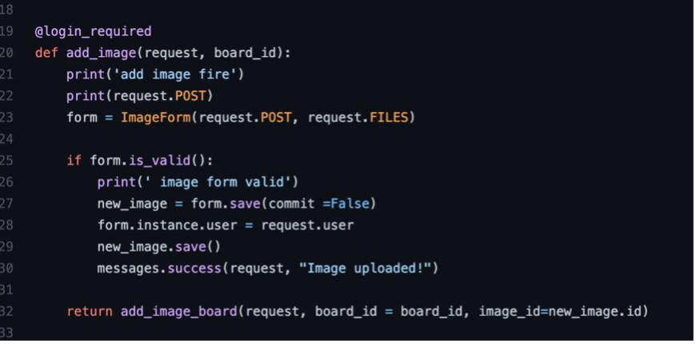

However, I still needed to ensure that the image would display instantly on the page without refreshing; since I was familiar with the association functionality, I drew upon my learning to adapt the code to make it work for images uploaded directly to the board.  
To do this, I had to create a second method, “add_image_board”, which would be returned by the “add image” method and executed as it returned, taking the “board.id” and the “new_image.id” as its parameters.

The add_image_board method obtains the board by its current ID, and I used the related managers ‘add’ method to associate the image with the board.Once the association has been made, it redirects the user to the board details page, which will render the recently added image.

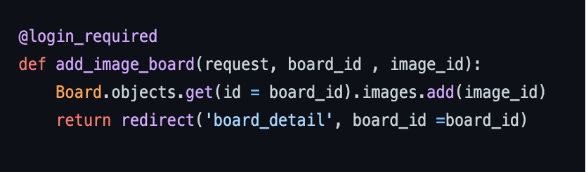

The user now had a board with all desired functionalities. Now it was time to style!

**Styling / Layout** 

We were keen to adopt the masonry layout that Pinterest is infamous for, so I knew this would require some attention as whilst I love the design aspect of web development, I am still trying to wrap my head around CSS.To achieve the desired result, I had to do some additional research to help me understand the approach I needed to take. 

The simple but effective solution that I was able to get a grasp on is noted below: 
 
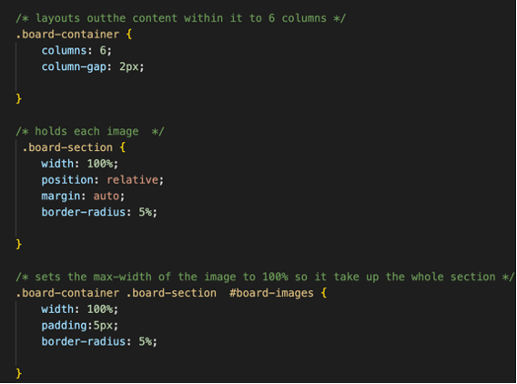

 The “board-container” is equivalent to the whole board area. It’s split into six columns, holding each added image. I set the “board-section" and the “board-images” to width 100%, so they take up the entire space of the column. Padding is applied to all elements to allow for extra spacing. 

Whilst I was proud that I could accomplish this, I will need to continue practising to consolidate my understanding fully. 

In addition to the layout of the images on the board, for a cleaner finish, I needed to ensure that all the other elements would only display upon the user's request. I used jQuery to assign and attribute classes to ensure that the additional image element would only show “on click”.Likewise, I did not want the associate and un-associate image functionality to be permanently showing under every individual image, so I used the hover selector component to ensure the options would only show if the user were hovering over that image.

Finally, I looked to keep the form styles consistent across the application, so I applied the same CSS classes my classmate had used on their forms to ensure they displayed the same.

### **Wins & Challenges**
---
I enjoyed having the opportunity to be a team leader as I gained more experience with GitHub (being responsible for merging our code) and got the chance to handle the deployment of the application. The team was great to work with and very supportive of each other; when issues arose, we were very open to screen sharing and discussing the problem.  

Django and PostgreSQL were challenging; I found the framework and database less flexible to work with than express and MongoDB/Mongoose. There were challenges throughout the week with migrations, where I’d update a model but be told by the terminal that no migrations were needed. I had to delete the database in full and restart it again.

### **Known Bugs**
---

* Links to other users’ profiles redirect you back to your profile, so their currently no way of acessing other users` boards. 
* The board index page renders when a board is deleted 
* Heroku file storage means images will only display on the application for a limited time
* Dark mode clears on refreshing the page 

### **Future Enhancements**
---
* Make the site fully responsive 
* Improve user flow through the site 
* Enhance the CSS for a cleaner finish
* Filter available images to add to the board by themes associated with the ‘subject’ of the board 

### **Key Learnings**
---
The course to date has focused on JavaScript, so this project allowed me to explore Python fundamentals. Whilst this was a new language, having one already under my belt made it easier for me to grasp the concept of Python relatively quickly. This gave me the confidence I needed to continue my coding journey. 

Secondly, I enjoyed this project as we worked within a realistic timeframe. We focused on getting the MVP application ready for the deadline and, as a result, presented an application that hit the required elements of the brief. It highlighted the importance of working through a structured process and the value of prioritising. 
